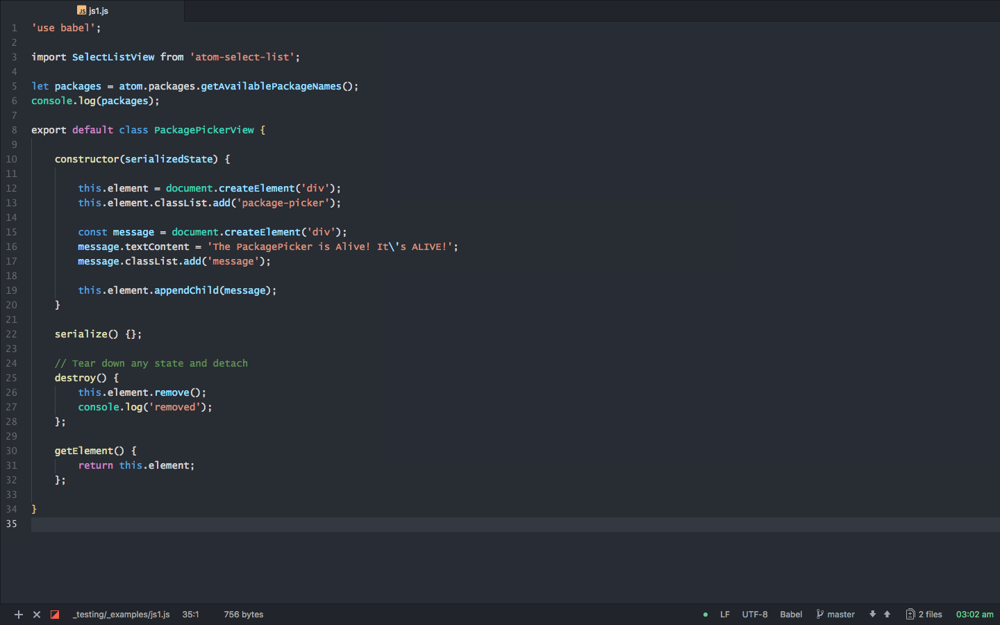
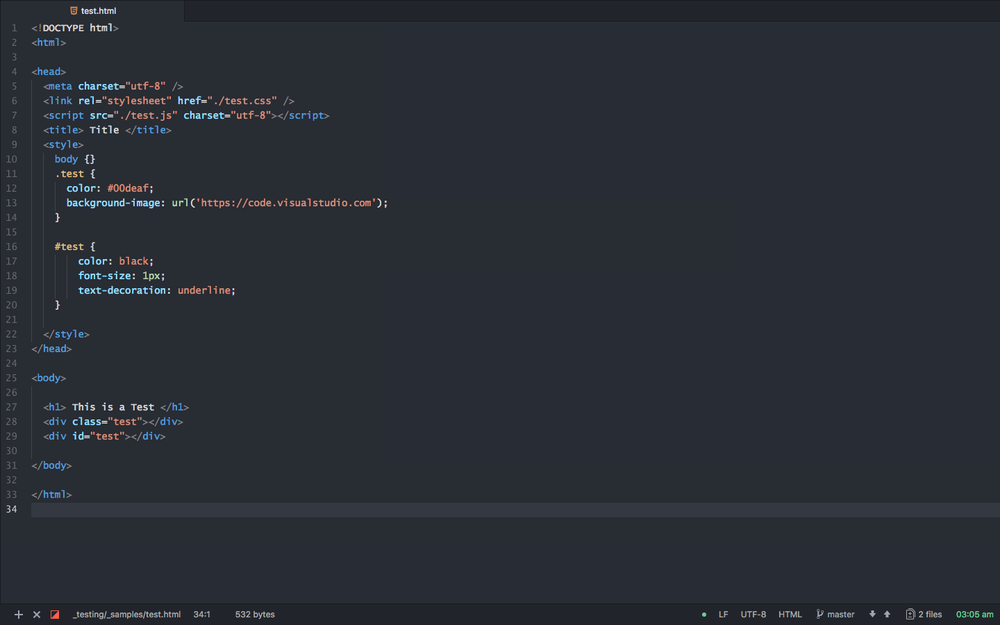

# dark-plus-syntax


[Visual Studio Code's](https://github.com/Microsoft/vscode/) `Dark+` (default dark) theme, ported to [Atom](https://github.com/atom/atom/). <br>
(Pairs well with Atom's [One Dark UI](https://atom.io/themes/one-dark-ui)) <br>
[(package on atom.io)](https://atom.io/themes/dark-plus-syntax)

#### JavaScript:


#### HTML:



##### More Screenshots:
  - [CoffeeScript](./images/coffee.png)
  - [markdown](./images/markdown.png)
  - [json](./images/json.png)


## Supported Languages:

- [x] HTML
- [x] CSS
- [x] LESS
- [x] SASS & SCSS
- [ ] Stylus
- [x] Markdown
- [ ] GFM
- [x] JavaScript
- [x] JavaScript (Babel)
- [ ] Javascript React (Babel) (JSX)
- [x] JSON & CSON
- [x] CoffeeScript
- [ ] TypeScript
- [ ] VUE

## Notes

If you'd rather have vscode's default background & cursor, just add this to your stylesheet:
```less
atom-text-editor {
    background-color: #1E1E1E;
    .cursor {
        border-left: 2px solid #D4D4D4;
    }
}
```
## License

The package is Open Source Software released under the [MIT](https://github.com/dunstontc/atom-vscode-syntax/blob/master/LICENSE.md) license.
